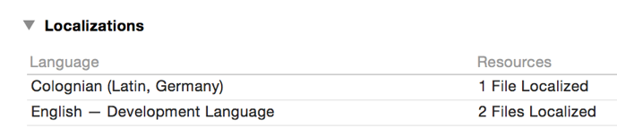
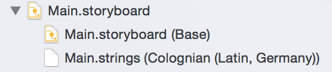

# Lost-In-Translation
## An attempt to localize into ksh-Latn_DE

This project is an attempt to localize an iOS App into "Colonian (Latin, Germany)", otherwise known as "Kölsch".

I have manually added a `ksh-Latn_DE.lproj` folder with a `Main.strings` file, and edited the `project.pbxproj` file to incude it. It seems to be working, Xcode obviously regognizes it, and the built project contains the `ksh-Latn_DE.lproj` Folder

## Steps To Reproduce

1. Set the iPhone's Language to "Kölsch". The list of languages should now be:
    * Kölsch
    * Deutsch (iPhone Sprache)
    * Englisch

2. Build and run this App

## Expected Result

The text in the center says "Lebenslang Köln-Kalk Verbot!"

## Actual Result

The text in the center says "You've lost your LA privileges"

## Notes 

While the current `NSLocale localeIdentifer` is `ksh-Latn_DE`, the first preferred Localization is `en`. This appears to be causing other apps trouble as well.

